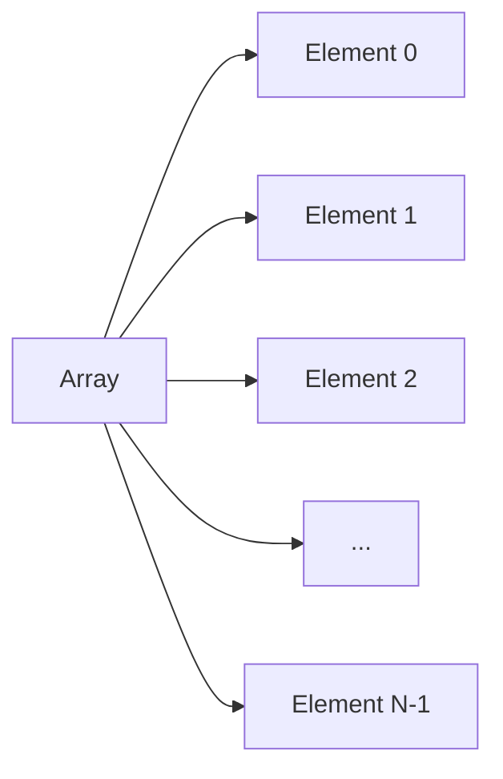

# Java Arrays Lab

## Introduction

In Java, an array is a collection of variables of the same type, stored in a contiguous block of memory. Arrays allow you to store multiple values in a single variable, which can be accessed using an index. Understanding arrays is fundamental in programming as they provide a way to manage and manipulate data efficiently.

### Key Concepts

- **Fixed Size**: Once an array is created, its size cannot be changed.
- **Zero-Based Indexing**: Array indexing starts at 0.
- **Homogeneous Elements**: All elements in an array are of the same data type.

#### Array Structure



## Different Ways of Declaring and Assigning an Array

There are several ways to declare and initialize arrays in Java.

### Declaration Without Initialization

```java
int[] numbers; // Declares an array of integers
```

### Declaration With Initialization

```java
int[] numbers = new int[5]; // Declares an array and allocates memory for 5 integers
```

### Inline Initialization

```java
int[] numbers = {1, 2, 3, 4, 5}; // Declares and initializes the array with values
```

### Using the `new` Keyword with Initialization

```java
int[] numbers = new int[]{1, 2, 3, 4, 5};
```

### Code Example

```java
public class ArrayDeclaration {
    public static void main(String[] args) {
        // Method 1: Declaration without initialization
        int[] array1;
        array1 = new int[3]; // Now initialized with default values (0, 0, 0)

        // Method 2: Declaration with size
        int[] array2 = new int[3]; // Initialized with default values

        // Method 3: Inline initialization
        int[] array3 = {1, 2, 3};

        // Method 4: Using new keyword with initialization
        int[] array4 = new int[]{4, 5, 6};

        // Displaying array elements
        for (int num : array3) {
            System.out.print(num + " ");
        }
    }
}
```

<details>
<summary>Output</summary>

```
1 2 3
```

</details>

## Array Length

The length of an array refers to the number of elements it can hold. In Java, you can access the length using the `.length` property.

### Code Example

```java
public class ArrayLength {
    public static void main(String[] args) {
        int[] numbers = {10, 20, 30, 40, 50};
        System.out.println("The length of the array is: " + numbers.length);
    }
}
```

<details>
<summary>Output</summary>

```
The length of the array is: 5
```

</details>

## Modifying Arrays

You can modify array elements by accessing them via their index and assigning new values.

### Code Example

```java
public class ModifyArray {
    public static void main(String[] args) {
        String[] fruits = {"Apple", "Banana", "Cherry"};
        fruits[1] = "Blueberry"; // Modifies the second element

        // Displaying modified array
        for (String fruit : fruits) {
            System.out.print(fruit + " ");
        }
    }
}
```

<details>
<summary>Output</summary>

```
Apple Blueberry Cherry
```

</details>

## 2D Arrays

A 2D array is an array of arrays, useful for representing grids or tables.

### Declaration and Initialization

```java
int[][] matrix = new int[3][3]; // 3x3 matrix with default values

int[][] predefinedMatrix = {
    {1, 2, 3},
    {4, 5, 6},
    {7, 8, 9}
};
```

### Code Example

```java
public class TwoDArray {
    public static void main(String[] args) {
        int[][] matrix = {
            {1, 2, 3}, // Row 0
            {4, 5, 6}, // Row 1
            {7, 8, 9}  // Row 2
        };

        // Accessing element at row 1, column 2
        System.out.println("Element at (1,2): " + matrix[1][2]);

        // Modifying element at row 0, column 0
        matrix[0][0] = 10;

        // Displaying the 2D array
        for (int i = 0; i < matrix.length; i++) { // Rows
            for (int j = 0; j < matrix[i].length; j++) { // Columns
                System.out.print(matrix[i][j] + " ");
            }
            System.out.println();
        }
    }
}
```

<details>
<summary>Output</summary>

```
Element at (1,2): 6
10 2 3 
4 5 6 
7 8 9 
```

</details>

## DIY Exercise Section

### Exercise 1: Declaring and Initializing Arrays

- **Task**: Declare an array of `double` with the values `1.5`, `2.5`, `3.5`, `4.5`.
- **Hint**: Use inline initialization.

### Exercise 2: Calculating Array Length

- **Task**: Write a program that calculates and prints the length of an array of your choice.
- **Hint**: Use the `.length` property.

### Exercise 3: Modifying Array Elements

- **Task**: Given an array `int[] nums = {10, 20, 30, 40}`, change the third element to `35` and print the array.
- **Hint**: Access the element at index 2.

### Exercise 4: Working with 2D Arrays

- **Task**: Create a 2D array representing the following table and print the sum of all elements.

```
1 2 3
4 5 6
7 8 9
```

- **Hint**: Use nested loops to traverse the 2D array.

## Summary

In this lab, we've covered:

- Various methods to declare and initialize arrays.
- Accessing and utilizing the array's length.
- Modifying elements within an array.
- Understanding and working with 2D arrays.

Arrays are a foundational aspect of Java programming, enabling efficient data storage and manipulation. Mastery of arrays will significantly aid in understanding more complex data structures and algorithms.
